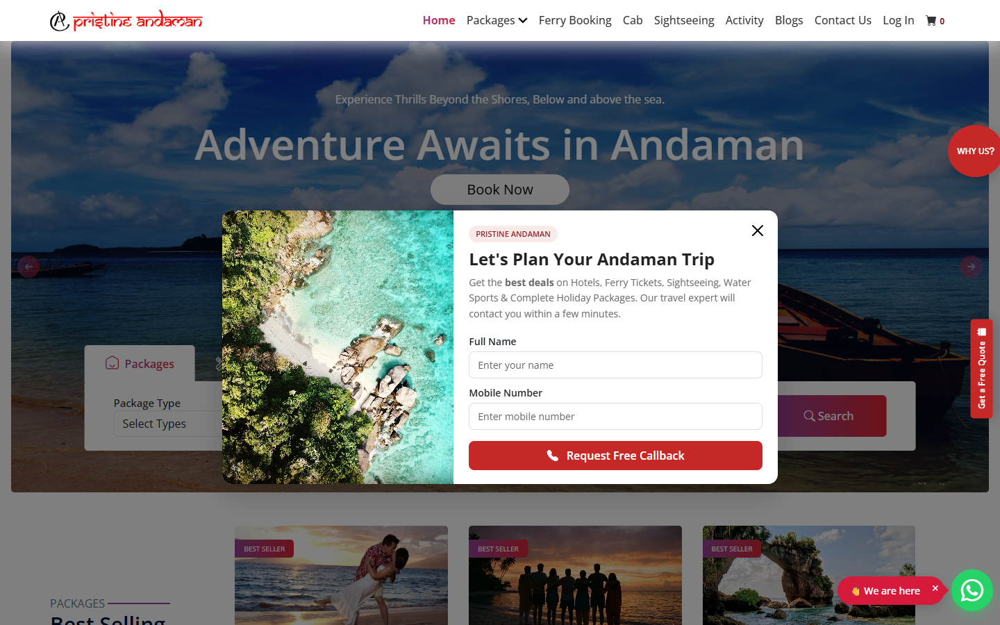

# GrocyPay Platform

Production platform case study covering discovery, booking and rewards-oriented user journeys.

## Overview

GrocyPay presents a multi-service consumer experience with destination packages, event booking, cashback and member-focused features.

## Product Experience

- Responsive landing and discovery interface
- Package and activity browsing
- Booking and callback journeys
- User account and membership touchpoints
- Promotional content and conversion-focused UI

## My Contribution

Selected professional work demonstrating responsive UI implementation, platform UX, front-end delivery and integration-focused web development.

## Live Website

[Visit GrocyPay](https://grocypay.com/)

> Portfolio case study. Brand names and website content belong to their respective owners.
